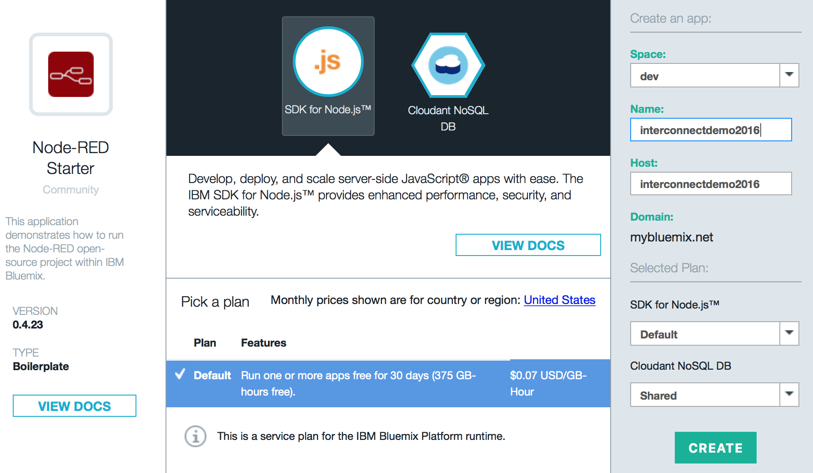
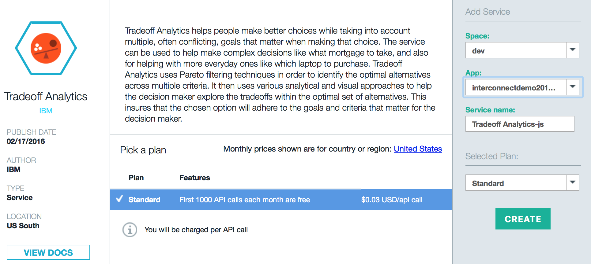

# Using Watson Trade-Off Analytics with Node-RED to Analyze Flight Options

1.) Create Node-RED Application on Bluemix

Once you're logged in to your Bluemix account go to 'Catalog' and click on the 'Node-RED Starter Community' application. 

On the right side of the screen you must give it a name, which must be unique. Then click 'Create'. Right now the Node-RED application is being created and deployed.

Staging will take a few minutes.

2.) Add Service Watson Tradeoff Analytics

Once Node-RED application staging completed, go back to Catalog and search for 'Tradeoff Analytics' and click on the application icon.

On the next page bind the service to our previously created Node-RED application and click 'Create'.

Because we added a new service to an application it will ask to 'Restage' the application, click on 'RESTAGE'.

X.)

[Sample Flight Data](https://raw.githubusercontent.com/chriwill/interconnect2016/master/flightstradeoffanalytics/data/flightdata.json)
