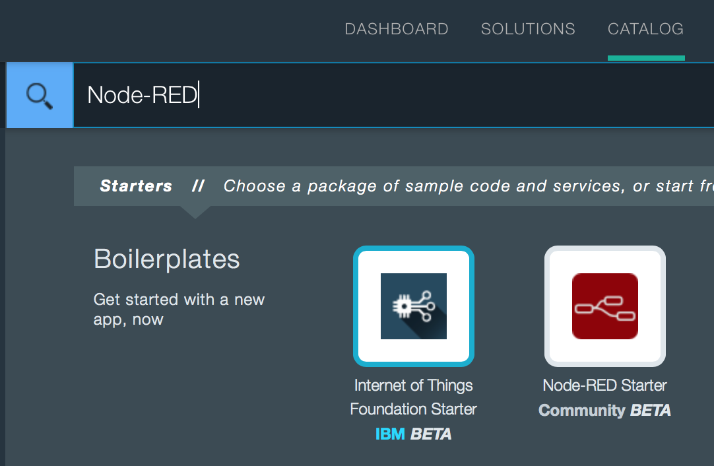
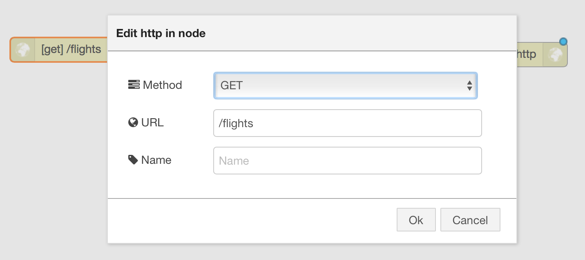
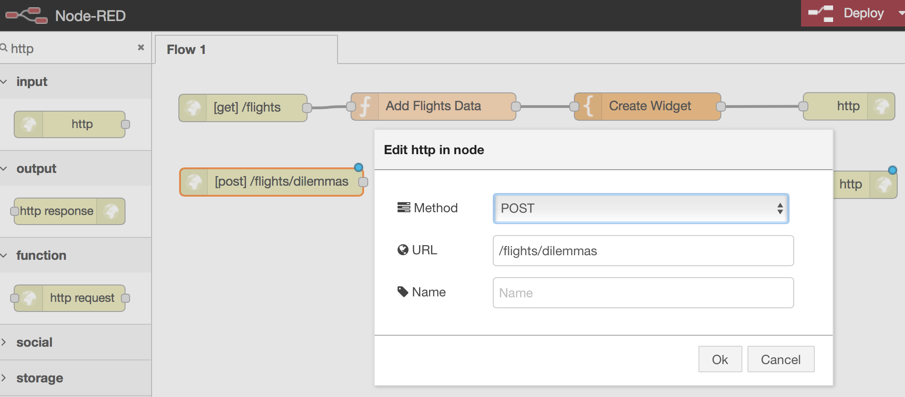
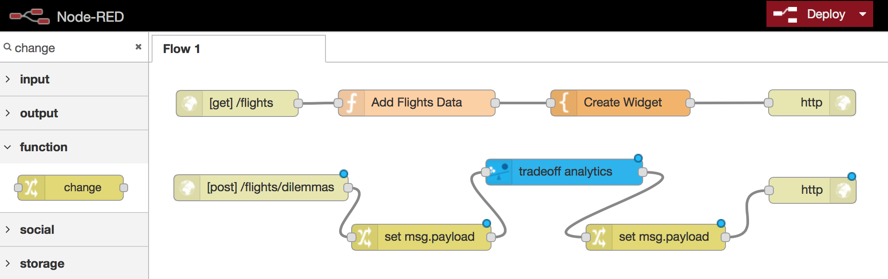
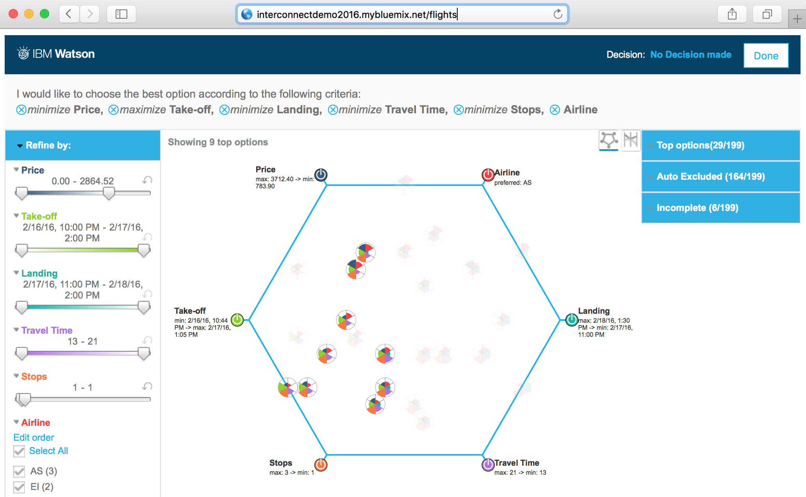

# Using Watson Trade-Off Analytics with Node-RED to Analyze Flight Options - Step-by-Step Guide

In this session you will build a travel advisor application that helps to analyze flight data and pick the best flight option based on individual preferences.

<b>Overview:</b>

<b>Step 1) Sign up / Login to Bluemix - https://console.ng.bluemix.net/</b>

<b>Step 2) Create Node-RED Application on Bluemix</b>

Once you're logged in to your Bluemix account go to 'Catalog' on top and click on the 'Node-RED Starter Community' application. 

On the right side of the screen you must give it a name, which must be unique. Then click 'Create'. Right now the Node-RED application is being created and deployed.

Staging will take a few minutes.

<b>Step 3) Add Service Watson Tradeoff Analytics</b>

Once Node-RED application staging completed, go back to Catalog and search for 'Tradeoff Analytics' and click on the application icon.

On the next page bind the service to our previously created Node-RED application and click 'Create'.

Next it will ask to restage the application to use the newly added service, click on 'RESTAGE'.

<b>Step 4) Start using Node-RED application</b>

Once restaging is complete, click on the link to open the Node-RED application.

Click on 'Go to your Node-RED flow editor'.

<b>Step 5) Create the application flow in Node-RED</b>

Our application will have two streams. The first stream is the 'User-interface', which will create the widget and supply the flight data.
The second stream will feed the watson service with the 'Dilemmas' and will return the results to the widget create with the first stream.

<b>Step 6) Create User-Interface Serving Stream</b>

Ever flow needs one input 'http' and one output 'http response' node. One the left side filter by 'http' and drag and drop the http node from input section on the left and the http response node form output section on the right.

We need to give the input http node a url. 'Click' on the input 'http' node and enter the url '/flights'.

Next we need to add one 'function' and one 'template' node. One the left side look under function section and drag and drop the 'function' node and 'template' node.
Once done, connect all nodes as shown below.

Our 'function' node will supply the application with sample flight data. For this 'double click' on our created function node and update the function name to 'Add Flight Data'. Next copy (⌘-A ⌘-C) the json content from this link
 [Sample Flight Data in JSON](https://raw.githubusercontent.com/chriwill/interconnect2016/master/flightstradeoffanalytics/data/flightdata.json) and paste it into the function section (⌘-V) as shown below.

Our 'template' node will define the User Interface of our application. For this 'double click' on the template node and give it a name 'Create Widget'. Next copy  (⌘-A ⌘-C) the raw HTML content from this link
[Widget HTML](https://raw.githubusercontent.com/chriwill/interconnect2016/master/flightstradeoffanalytics/data/widget.txt) and paste it into the template section (⌘-V) as shown below.

What the \<script> section does is to:
  - Include the widget's script located at "http://ta-cdn.mybluemix.net/v1/TradeoffAnalytics.js"
  - Start the widget initialization with the `loadTradeoffAnalytics()` call, triggered by `window.onload`.  
  - This invokes the constructor, with parameters to set the dilemmas and events callback URLs, and the id of the placeholder widget's \
.
  - The `start()` method is called, which will asynchronously build the widget and pull its dependencies.
  - On the TAReady event notification, we invoke `show(problem)`.  This will cause the widget to call-back on the server's `tofaw/dilemmas` URL with the problem for resolution.
  - Once the data has come back from the dilemmas server, the widget shows the problem and triggers onTAShown(), which is used to resize the widget to fit. 

The User-Interface stream is complete and it should look like this:

<b>7) Create Dilemmas Processing Stream</b>

The Dilemmas Processing Stream needs one input 'http' and one output 'http response' node. One the left side filter by 'http' and drag and drop the http node from input section on the left and the http response node form output section on the right.

We need to give the input http node a url and change it's method. 'Click' on the input 'http' node and enter the url '/flights/dilemmas' and set the method to 'POST' as shown bellow.

Next we will add the Watson 'tradeoff analytics' node and two 'change' function nodes. One the left side filter by 'tradeoff' and drag and drop the http node from input section on the left and the http response node form output section on the right. Do the same and add two 'change' nodes.
Once done, connect all nodes as shown below.

This flow on flights/dilemmas will make some parameters adjustments through a change node, setting subject, columns and options from the payload, storing the incoming problem for later use, and then calling the tradeoff analytics through its Node-RED service node. 

'Double Click' on the left 'change' node, rename the node 'Get Data from Payload' and set the rules as shown below.

On return, another change node will adjust the returned payload parameters's problemand resolution to fit the format expected by the widget and return it as a JSON object.

'Double Click' on the right 'change' node, rename the node 'Adjust Output for Widget' and set the rules as shown below.

For completion 'double click' the 'tradeoff analytics' node and rename it 'Run Tradeoff Analytics'.

<b>Step 8) Deploy & Run your application</b>

Your application should look like this and is ready to be deploy.

Click the 'Deploy' button on the top right section of the editor to deploy the application.

Your application is ready to use.

Go to your browser and change the URL from the Node-RED application '/red' to '/flights'.

<b>Appendix) Application flow file</b>

You can download the complete flow file [here](https://raw.githubusercontent.com/chriwill/interconnect2016/master/flightstradeoffanalytics/data/node_red_export.json)  and import it into your Node-RED instance.

