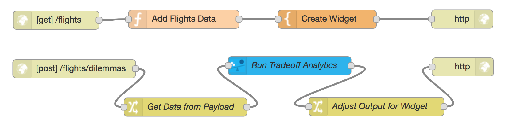
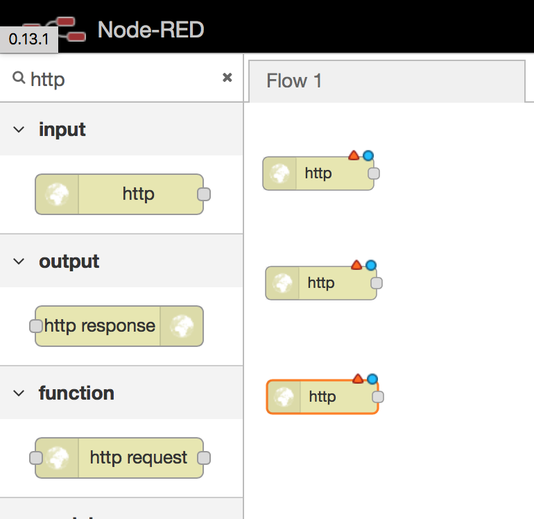
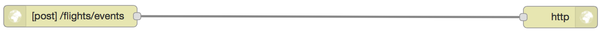

# Using Watson Trade-Off Analytics with Node-RED to Analyze Flight Options - Step-by-Step Guide

In this session you will build a travel advisor application that helps to analyze flight data and pick the best flight option based on individual preferences.

<b>Overview:</b>

<b>1.) Create Node-RED Application on Bluemix</b>

Once you're logged in to your Bluemix account go to 'Catalog' and click on the 'Node-RED Starter Community' application. 

On the right side of the screen you must give it a name, which must be unique. Then click 'Create'. Right now the Node-RED application is being created and deployed.

Staging will take a few minutes.

<b>2.) Add Service Watson Tradeoff Analytics</b>

Once Node-RED application staging completed, go back to Catalog and search for 'Tradeoff Analytics' and click on the application icon.

On the next page bind the service to our previously created Node-RED application and click 'Create'.

Next it will ask to restage the application to use the newly added service, click on 'RESTAGE'.

<b>3.) Start using Node-RED application</b>

Once restaging is complete, click on the link to open the Node-RED application.

Click on 'Go to your Node-RED flow editor'.

<b>4.) Trade-Off Analytics Widget flow construction</b>

The flow to achieve this has three streams:

4.1) User-interface serving stream

Create Input - HTTP Request

4.2) Create Output - HTTP Response

4.3) Add Function & Template to first row

4.4) Define Function to supply the Flight data

'Double Click' on our created function node and update the function name to 'Add Flight Data'.
In addition we have to supply sample flight data, a sample data set can be found here : [Sample Flight Data](https://raw.githubusercontent.com/chriwill/interconnect2016/master/flightstradeoffanalytics/data/flightdata.json).

Copy the data set 'Command-C' and paste it into the function definition 'Command-V'.

4.5) Define Template with Tradeoff Analytics widget

Name Template 'Create Widget'
[Widget HTML](https://raw.githubusercontent.com/chriwill/interconnect2016/master/flightstradeoffanalytics/data/widget.txt)

What the \<script> section does is to:
  - Include the widget's script located at "http://ta-cdn.mybluemix.net/v1/TradeoffAnalytics.js"
  - Start the widget initialization with the `loadTradeoffAnalytics()` call, triggered by `window.onload`.  
  - This invokes the constructor, with parameters to set the dilemmas and events callback URLs, and the id of the placeholder widget's \
.
  - The `start()` method is called, which will asynchronously build the widget and pull its dependencies.
  - On the TAReady event notification, we invoke `show(problem)`.  This will cause the widget to call-back on the server's `tofaw/dilemmas` URL with the problem for resolution.
  - Once the data has come back from the dilemmas server, the widget shows the problem and triggers onTAShown(), which is used to resize the widget to fit.

4.6) Edit Processing Row 

Dilemmas serving stream

This flow on tofaw/dilemmas will make some parameters adjustments through a change node, setting subject, columns and options from the payload, storing the incoming problem for later use, and then calling the tradeoff analytics through its Node-RED service node. On return, another change node will adjust the returned payload parameters's problemand resolution to fit the format expected by the widget and return it as a JSON object.

4.7) Connect Last Row

<b>5.) Run Deploy</b>

<b>6.) Run the application</b>

