# Using Watson Visual Recognition with Node-RED to recognize the content of the image - Step-by-Step Guide

In this lab we will build a travel advisor application that recognizes the content of the image which can be used to provide more information about the destination. 

<h4>Overview :</h4>

<h4>Step 1 : Sign up / Login to Bluemix - https://console.ng.bluemix.net/</h4>

<h4>Step 2 : Go to Catalog tab and search for Node-RED service.</h4>

Click on Node-RED to create the application.

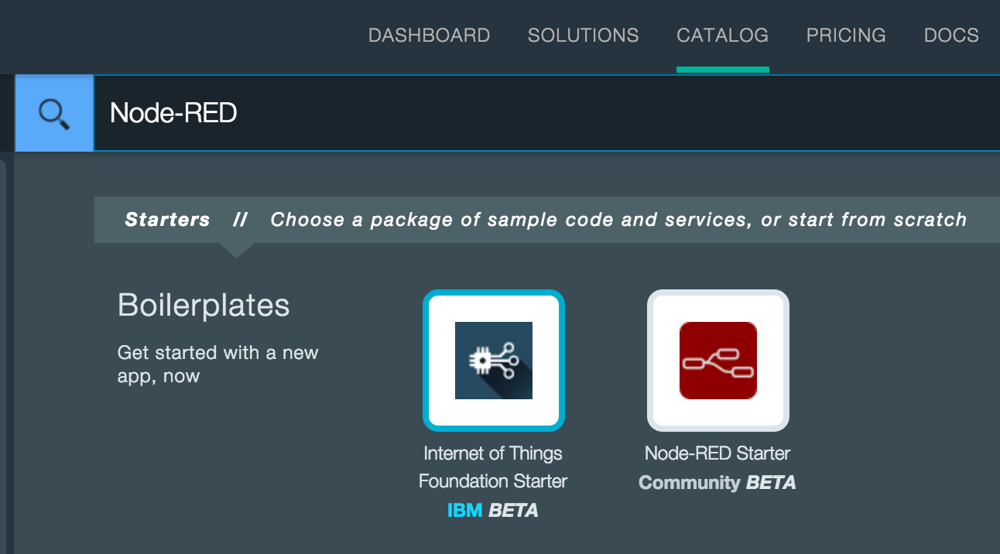

<h4>Step 3 : Click on Node-Red and give a unique name for the application</h4>

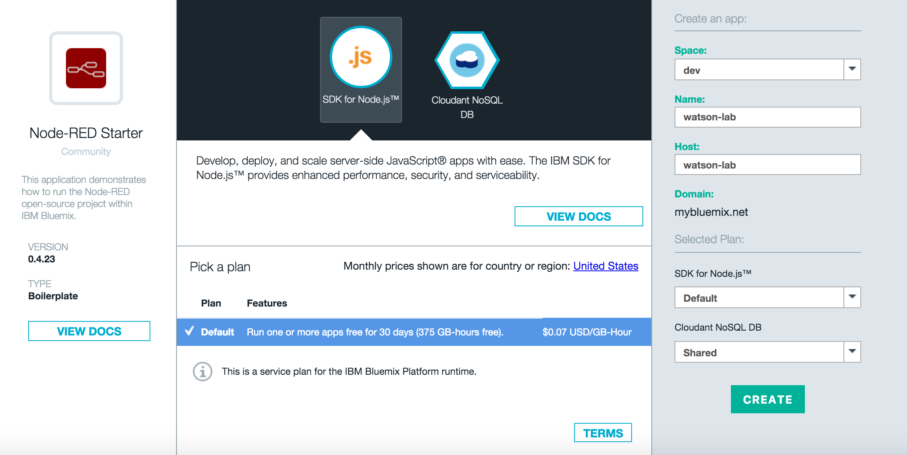

Staging will take few minutes 

Yayyyy its running and ready to use!!

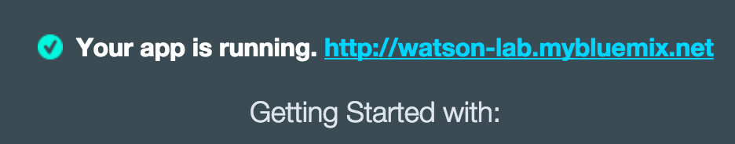

You can verify now that a Node-RED application is created with a Cloudant database

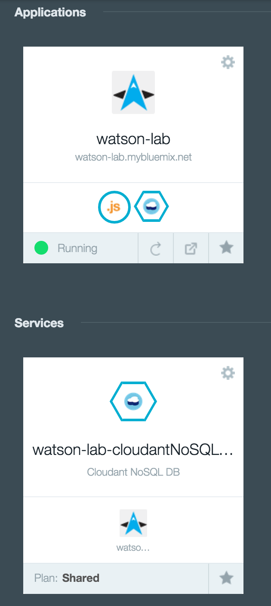

<h4>Step 4 : Switch to Catalog tab and search for 'Visual Recognition' service</h4>

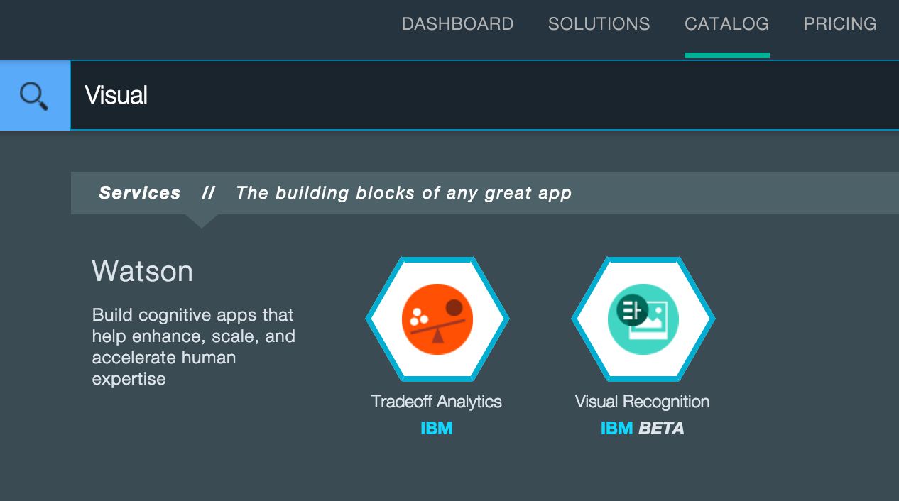

<h4>Step 5 : Create a Visual Recognition service and bind it with Node-RED application created in the above step.</h4>

Select the Node-RED application from the dropdown -

	
	
	
To bind the Visual Recognition service to the Node-RED application, click 'Restage' to restart the node-red application.

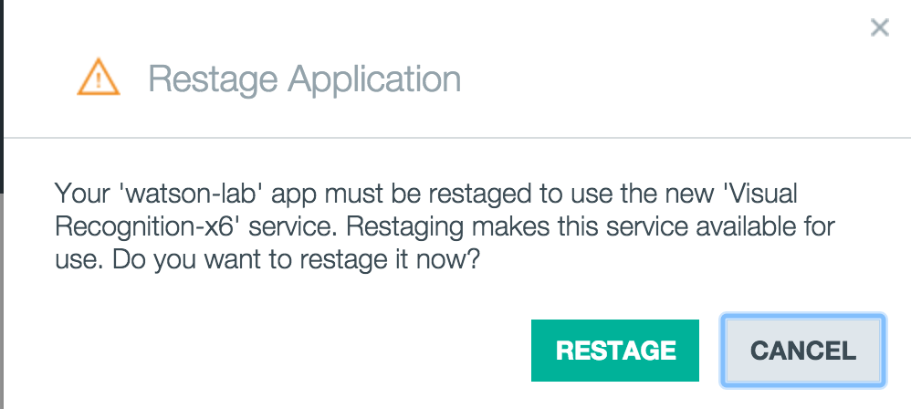

Your Visual recognition service is now bound to the Node-RED application

Click on Application url and Navigate to node red flow editor

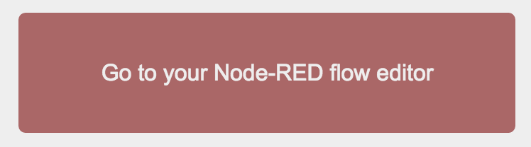	

<h4>Step 6 : Create the application flow in Node-RED editor</h4>

6.1) - Drag and drop the Http node from Input section on the left and also get the http response node form output section.

	

6.2)  - Double click on the http input node to configure the get API as shown below and click 'Ok'

	

6.3)  - Double click on http response node and provide name for the node.

	

	
Click the 'Deploy' button on the top right section of the editor to deploy the application

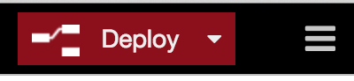

6.4)  - Search the 'switch' node and add to the flow editor

	

Configure the switch node that check if no url has been provided then reload the same page (switch nodes are mostly used for if-else cases)

6.5)  - Search for 'change' node and add to the flow editor 

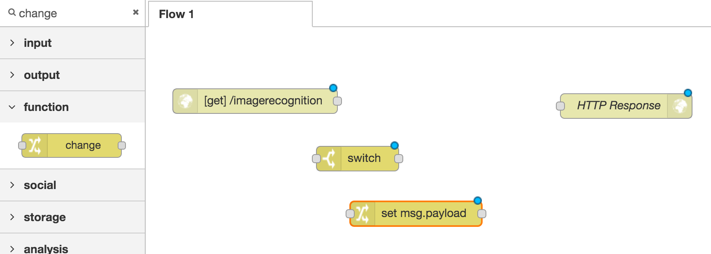	

Configure it to parse and pass imageurl from the payload object

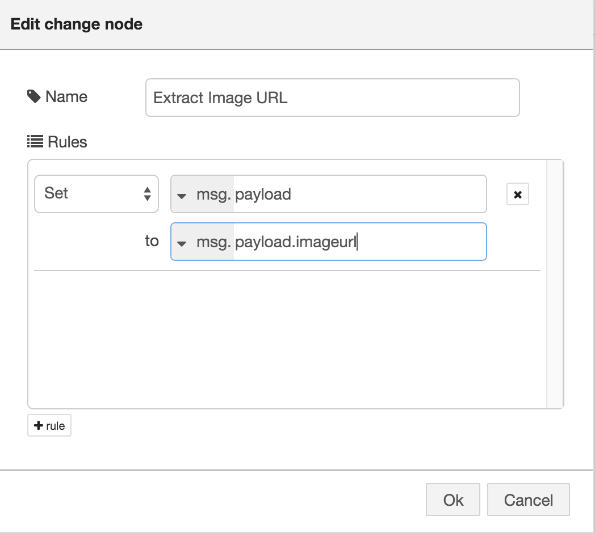	

6.6)  - Search for 'template' node and add 2 template nodes to the editor - 1- Building homepage and 2- Generate report

Configure one of the template node which Creates Application Homepage - 

Change the Syntax Highlight to  - HTML from the dropdown on the left
Copy the raw html content from this same data to the template section [Sample HTML Form Content](https://raw.githubusercontent.com/zankhanapathak/watson-visual-recognition-app/master/application_forms/application_homepage.html).

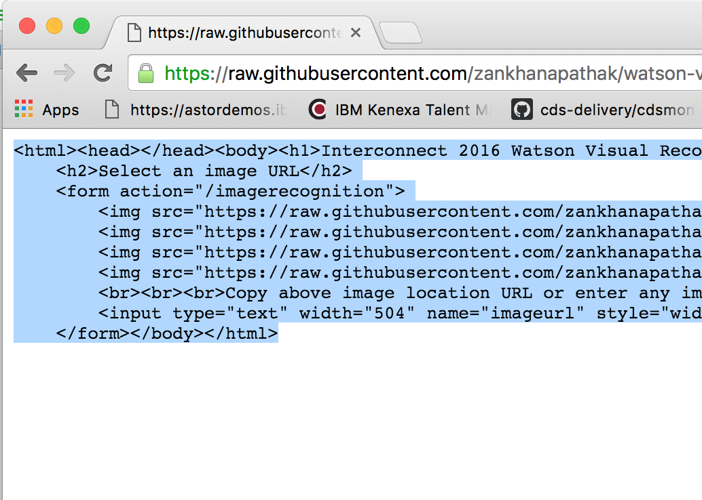

Connect the Nodes as shown below : 

To explain the flow- the Get call will pass the imageurl info as payload to the Image parameter node, which then will parse the input and check if its null will reload the same home page and send as response. And If any input is provided it will send the payload to extract the image url node to process it further.

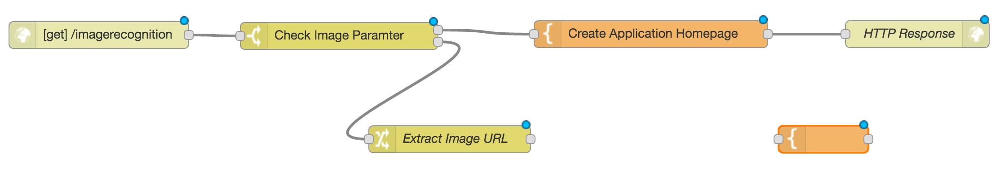

Click the 'Deploy' button on the top right section of the editor to deploy the application

6.7)  -  Search for 'Visual Recognition' node and add it to the flow editor and connect it to the Extract Image URL node as shown below

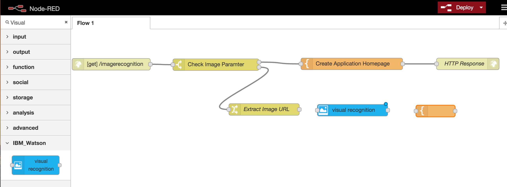

6.8)  -  Configure the remaining 'template' node to generate reports - This template node get the result from the 'Visual recognition' node and sends the ouput to the 'HTTP Response' node

Copy the raw html content from this same data to the template section [Sample HTML Form Content](https://raw.githubusercontent.com/zankhanapathak/watson-visual-recognition-app/master/application_forms/report_form.html).

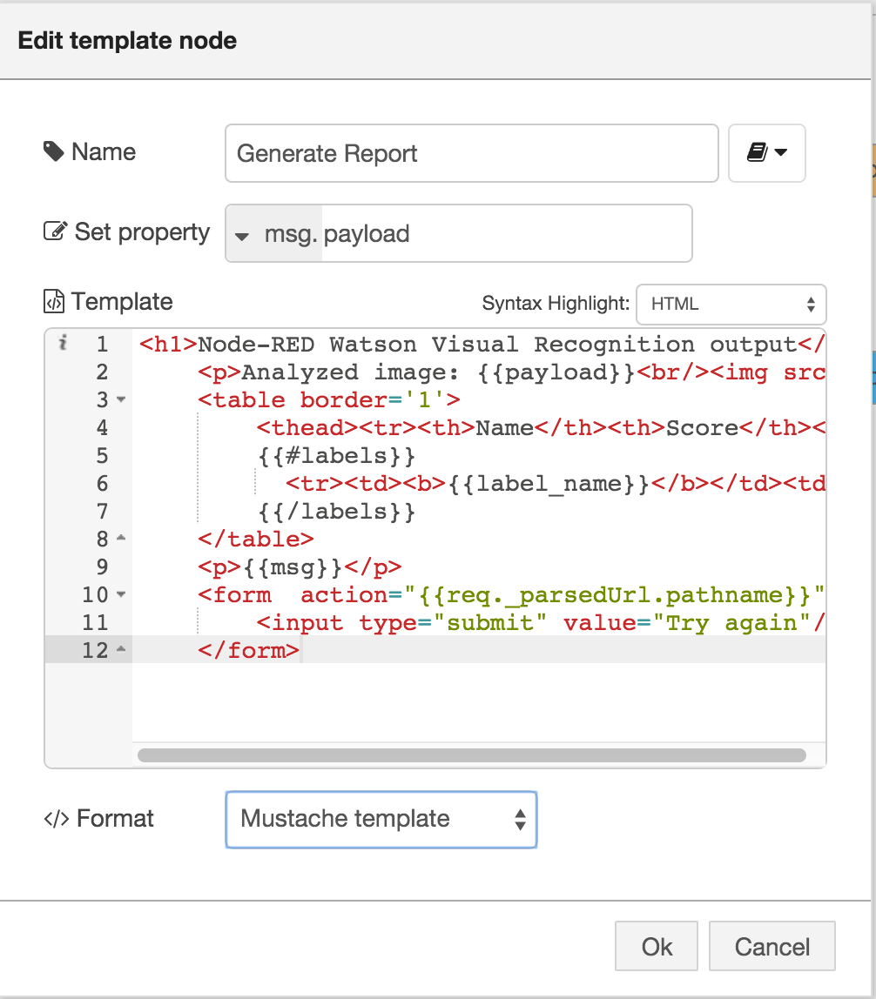

Connect the Visual Recognition, Generate Report and HTTP Response nodes as shown below :

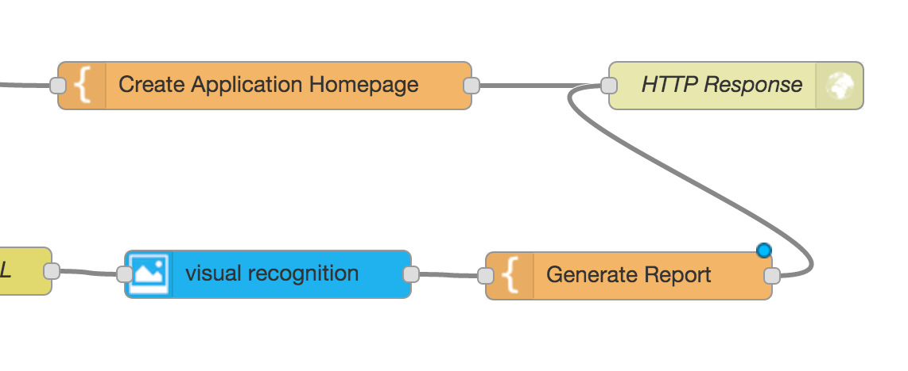

Click the 'Deploy' button on the top right section of the editor to deploy the application

Your application is ready to use!!! 

<h4>Step 7 :  Run the Application - Go to your browser and change the URL from the Node-RED application '/red' to '/imagerecognition'.</h4>

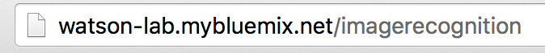

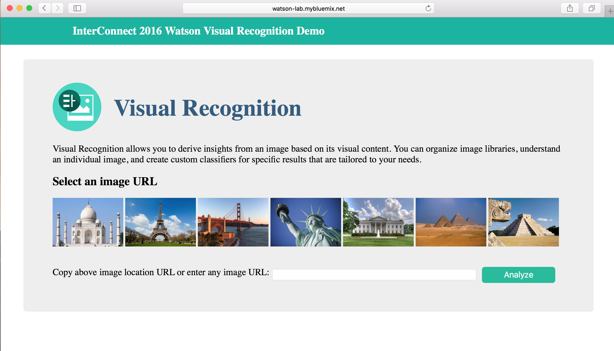

<b>Appendix) Application flow file</b>

You can download the complete flow file [here](https://raw.githubusercontent.com/zankhanapathak/watson-visual-recognition-app/master/application_forms/visualapp_node_red_export.json)  and import it into your Node-RED instance.

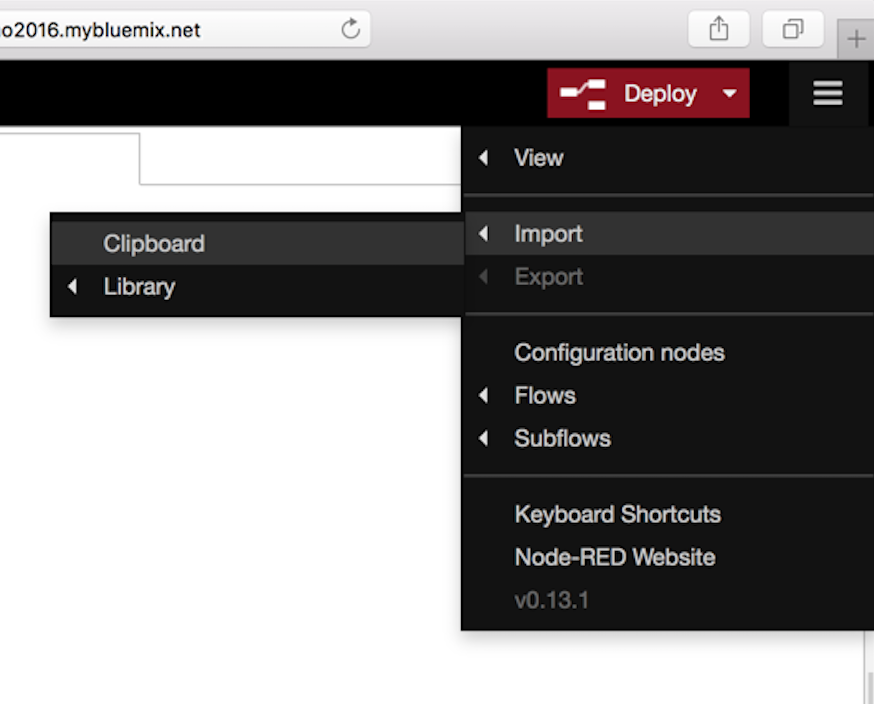

